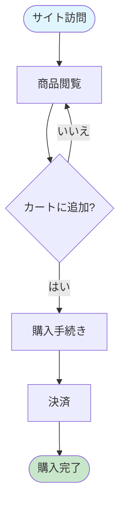
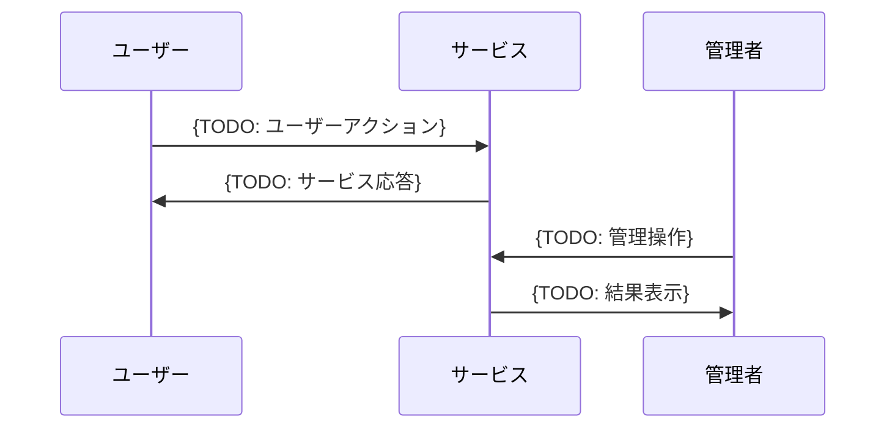
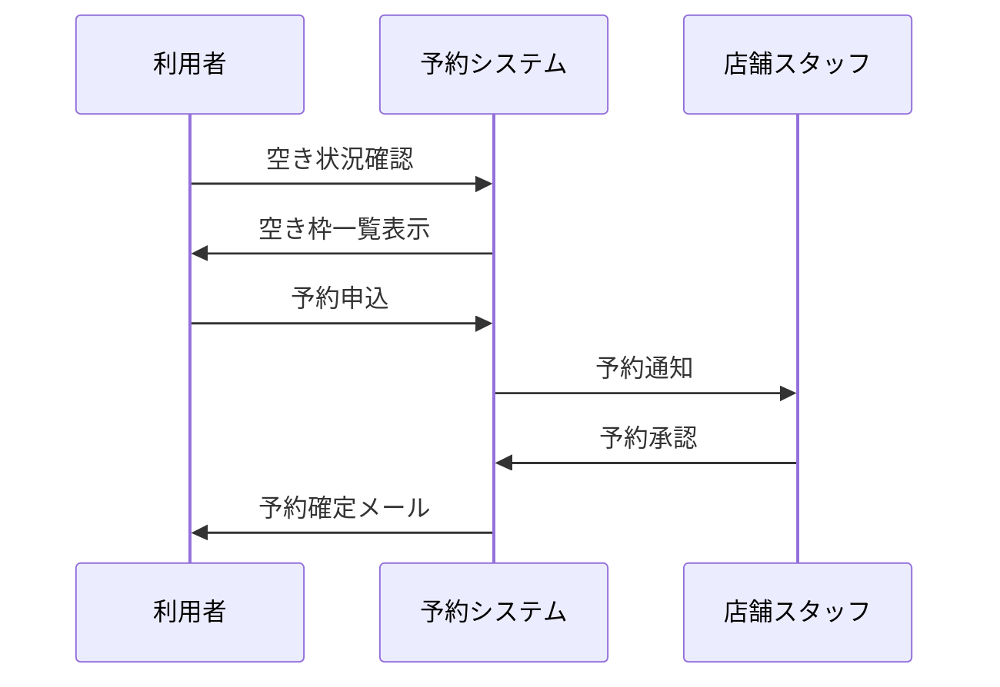

# {TODO: サービス名} - プロジェクト仕様書

## 1. サービス全体の流れ

### 1.1 ユーザージャーニー

{TODO: サービス利用開始から完了までの流れを Mermaid で記述}

```mermaid
flowchart TB
    Start([{TODO: 開始トリガー}]) --> Step1[{TODO: ステップ1}]
    Step1 --> Decision1{TODO: 分岐条件}
    Decision1 -->|条件A| Step2A[{TODO: ステップ2A}]
    Decision1 -->|条件B| Step2B[{TODO: ステップ2B}]

    Step2A --> Complete([{TODO: 完了状態}])
    Step2B --> Complete

    style Start fill:#e1f5fe
    style Complete fill:#c8e6c9
```

<!--
サンプル（ECサイト）:


-->

### 1.2 主要フローの詳細

{TODO: 主要なフローをシーケンス図で記述}



<!--
サンプル（予約フロー）:


-->

## 2. プロジェクト概要

### 2.1 目的

{TODO: プロジェクトの目的を2-3文で記述}

<!--
サンプル:
中小企業向けの在庫管理を効率化するSaaSプラットフォームを提供する。
直感的なUIと自動化機能により、従来の手作業による管理工数を80%削減し、
在庫切れ・過剰在庫を防止することで経営効率の向上を実現する。
-->

### 2.2 サービス概要

{TODO: サービスを構成する主要な要素を記述}

- **{TODO: 要素1}**: {TODO: 説明}
- **{TODO: 要素2}**: {TODO: 説明}
- **{TODO: 要素3}**: {TODO: 説明}

<!--
サンプル:
- **予約管理**: オンラインでの予約受付・変更・キャンセル
- **顧客管理**: 顧客情報の一元管理、来店履歴の記録
- **通知機能**: リマインダー・キャンペーン情報の自動配信
-->

### 2.3 ターゲットユーザー

{TODO: 主要なユーザーペルソナを記述}

| ペルソナ | 説明 | 主な利用機能 |
|---------|------|-------------|
| {TODO: ペルソナ1} | {TODO: 説明} | {TODO: 機能} |
| {TODO: ペルソナ2} | {TODO: 説明} | {TODO: 機能} |

<!--
サンプル:
| ペルソナ | 説明 | 主な利用機能 |
|---------|------|-------------|
| 店舗オーナー | 小規模小売店の経営者 | ダッシュボード、レポート、発注管理 |
| 倉庫スタッフ | 入出庫作業担当 | 在庫スキャン、棚卸し、ピッキング |
| 経理担当 | 在庫金額・原価管理 | 棚卸資産レポート、仕入管理 |
-->

### 2.4 スケジュール・マイルストーン

{TODO: 主要なマイルストーンを記述}

| フェーズ | 内容 | 期間 |
|---------|------|------|
| {TODO: フェーズ1} | {TODO: 内容} | {TODO: 期間} |
| {TODO: フェーズ2} | {TODO: 内容} | {TODO: 期間} |

## 3. 機能要件定義

### 3.1 {TODO: 機能カテゴリ1}

#### 3.1.1 {TODO: 機能1-1}

**概要**: {TODO: 機能の概要を1-2文で}

**ユーザーストーリー**:
- {TODO: ユーザー種別}として、{TODO: 達成したいこと}したい。なぜなら{TODO: 理由}だから。

**受け入れ条件**:
- [ ] {TODO: 条件1}
- [ ] {TODO: 条件2}
- [ ] {TODO: 条件3}

**実装ステータス**: {未着手 | 実装中 | 実装済み}

<!--
サンプル（認証機能）:

#### 3.1.1 ユーザー登録

**概要**: 新規ユーザーがメールアドレスとパスワードでアカウントを作成できる。

**ユーザーストーリー**:
- 新規利用者として、メールアドレスでアカウントを作成したい。なぜならサービスを利用開始するためだから。

**受け入れ条件**:
- [ ] メールアドレス形式のバリデーションが行われる
- [ ] パスワードは8文字以上が必須
- [ ] 確認メールが送信され、リンククリックで本登録完了
- [ ] 既存メールアドレスでの重複登録はエラー

**実装ステータス**: 実装済み
-->

#### 3.1.2 {TODO: 機能1-2}

**概要**: {TODO: 機能の概要}

**ユーザーストーリー**:
- {TODO: ストーリー}

**受け入れ条件**:
- [ ] {TODO: 条件}

**実装ステータス**: {未着手 | 実装中 | 実装済み}

### 3.2 {TODO: 機能カテゴリ2}

#### 3.2.1 {TODO: 機能2-1}

**概要**: {TODO: 機能の概要}

**ユーザーストーリー**:
- {TODO: ストーリー}

**受け入れ条件**:
- [ ] {TODO: 条件}

**実装ステータス**: {未着手 | 実装中 | 実装済み}

### 3.3 {TODO: 機能カテゴリ3}

{TODO: 必要に応じて機能カテゴリを追加}

## 4. 画面一覧

### 4.1 {TODO: 画面カテゴリ1}

| 画面名 | 説明 | 優先度 |
|--------|------|--------|
| {TODO: 画面1} | {TODO: 説明} | {高/中/低} |
| {TODO: 画面2} | {TODO: 説明} | {高/中/低} |

<!--
サンプル:
| 画面名 | 説明 | 優先度 |
|--------|------|--------|
| ログイン | メール/パスワード認証 | 高 |
| ダッシュボード | KPI概要表示 | 高 |
| 在庫一覧 | 商品在庫の検索・表示 | 高 |
| 在庫詳細 | 個別商品の詳細・履歴 | 中 |
-->

## 5. ビジネス制約

### 5.1 運用制約

- {TODO: 運用時間帯}
- {TODO: サポート体制}

<!--
サンプル:
- 営業時間: 平日9:00-18:00
- サポート対応: メールは24時間受付、電話は営業時間内
- メンテナンス: 毎週日曜深夜2:00-4:00
-->

### 5.2 法規制・コンプライアンス

- {TODO: 適用される法規制}
- {TODO: 業界ガイドライン}

<!--
サンプル:
- 個人情報保護法の遵守
- 利用者同意の明示的な取得
- データの国内保管義務
-->

## 6. ドメイン用語集

{TODO: プロジェクト固有の用語を定義}

| 用語 | 定義 |
|------|------|
| {TODO: 用語1} | {TODO: 定義} |
| {TODO: 用語2} | {TODO: 定義} |

<!--
サンプル:
| 用語 | 定義 |
|------|------|
| SKU | Stock Keeping Unit。在庫管理の最小単位となる商品識別子 |
| ロット | 同一条件で製造された製品のまとまり。トレーサビリティに使用 |
| 安全在庫 | 需要変動に備えて維持する最低在庫量 |
-->

## 7. 今後の拡張性考慮事項

{TODO: 将来的に追加を検討している機能}

- {TODO: 拡張機能1}
- {TODO: 拡張機能2}
- {TODO: 拡張機能3}

---

## 変更履歴

| 日付 | 変更内容 |
|------|----------|
| {TODO: yyyy-mm-dd} | 初版作成 |
