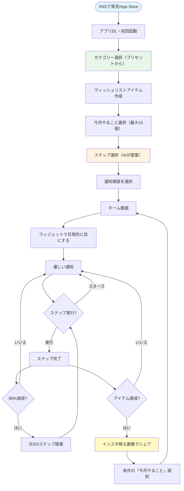
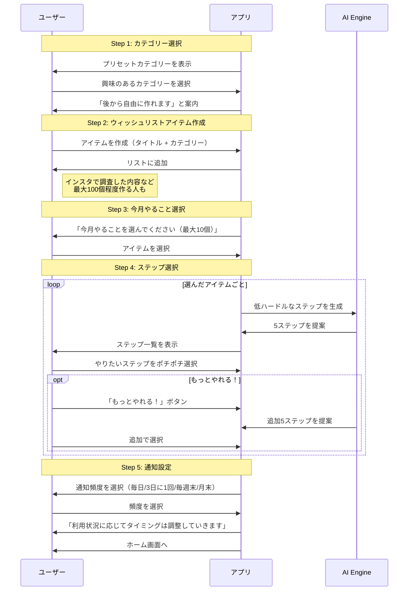
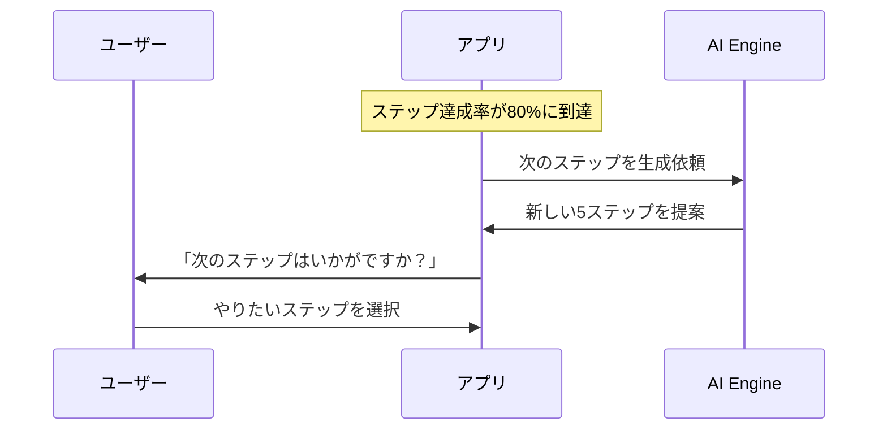
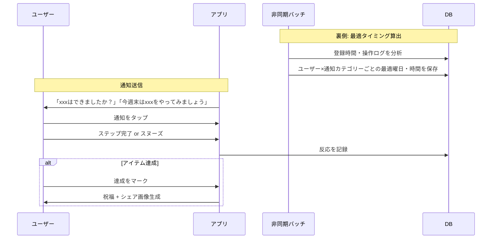

# ウィッシュリスト管理アプリ（仮称） - プロジェクト仕様書

## 1. サービス全体の流れ

### 1.1 データ構造の概念

```
カテゴリー（HOME画面上の最大単位）
  └─ ウィッシュリストアイテム（複数カテゴリーに所属可能）
       └─ ステップ（アイテムに複数紐づく）

今月やること（最大10個）
  └─ ウィッシュリストアイテムから選択
```

### 1.2 ユーザージャーニー


```mermaid
flowchart TB
    Start([SNSで発見/App Store]) --> Download[アプリDL・初回起動]
    Download --> Category[カテゴリー選択（プリセットから）]
    Category --> Create[ウィッシュリストアイテム作成]
    Create --> Select[今月やること選択（最大10個）]
    Select --> Step[ステップ選択（AIが提案）]
    Step --> Notify[通知頻度を選択]
    Notify --> Home[ホーム画面]
    Home --> Widget[ウィジェットで日常的に目にする]
    Widget --> Nudge[優しい通知]
    Nudge --> Action{ステップ実行?}
    Action -->|実行| Progress[ステップ完了]
    Action -->|スヌーズ| Nudge
    Progress --> Check{80%達成?}
    Check -->|はい| MoreStep[次の5ステップ提案]
    Check -->|いいえ| Nudge
    MoreStep --> Action
    Progress --> AllDone{アイテム達成?}
    AllDone -->|はい| Share[インスタ映え画像でシェア]
    AllDone -->|いいえ| Nudge
    Share --> NextMonth[来月の「今月やること」選択]
    NextMonth --> Home

    style Start fill:#e1f5fe
    style Category fill:#e8f5e9
    style Step fill:#fff3e0
    style Share fill:#fff9c4
```

### 1.3 登録初日の体験フロー


```mermaid
sequenceDiagram
    participant U as ユーザー
    participant App as アプリ
    participant AI as AI Engine

    Note over U,App: Step 1: カテゴリー選択
    App->>U: プリセットカテゴリーを表示
    U->>App: 興味のあるカテゴリーを選択
    App->>U: 「後から自由に作れます」と案内

    Note over U,App: Step 2: ウィッシュリストアイテム作成
    U->>App: アイテムを作成（タイトル + カテゴリー）
    App->>U: リストに追加
    Note right of U: インスタで調査した内容など<br/>最大100個程度作る人も

    Note over U,App: Step 3: 今月やること選択
    App->>U: 「今月やることを選んでください（最大10個）」
    U->>App: アイテムを選択

    Note over U,App: Step 4: ステップ選択
    loop 選んだアイテムごと
        App->>AI: 低ハードルなステップを生成
        AI->>App: 5ステップを提案
        App->>U: ステップ一覧を表示
        U->>App: やりたいステップをポチポチ選択
        opt もっとやれる！
            U->>App: 「もっとやれる！」ボタン
            AI->>App: 追加5ステップを提案
            U->>App: 追加で選択
        end
    end

    Note over U,App: Step 5: 通知設定
    App->>U: 通知頻度を選択（毎日/3日に1回/毎週末/月末）
    U->>App: 頻度を選択
    App->>U: 「利用状況に応じてタイミングは調整していきます」

    App->>U: ホーム画面へ
```

### 1.4 ステップ追加提案フロー


```mermaid
sequenceDiagram
    participant U as ユーザー
    participant App as アプリ
    participant AI as AI Engine

    Note over App: ステップ達成率が80%に到達
    App->>AI: 次のステップを生成依頼
    AI->>App: 新しい5ステップを提案
    App->>U: 「次のステップはいかがですか？」
    U->>App: やりたいステップを選択
```

### 1.5 通知〜達成フロー


```mermaid
sequenceDiagram
    participant U as ユーザー
    participant App as アプリ
    participant Batch as 非同期バッチ
    participant DB as DB

    Note over Batch,DB: 裏側: 最適タイミング算出
    Batch->>DB: 登録時間・操作ログを分析
    Batch->>DB: ユーザー×通知カテゴリーごとの最適曜日・時間を保存

    Note over App,U: 通知送信
    App->>U: 「xxxはできましたか？」「今週末はxxxをやってみましょう」
    U->>App: 通知をタップ
    U->>App: ステップ完了 or スヌーズ
    App->>DB: 反応を記録

    alt アイテム達成
        U->>App: 達成をマーク
        App->>U: 祝福 + シェア画像生成
    end
```

## 2. プロジェクト概要

### 2.1 目的

ユーザーのウィッシュリストを「今月やること」として可視化し、優しい通知で第一歩を促すモバイルアプリを提供する。
マイクロマネジメントではなく、ユーザーに寄り添いながら目標達成をサポートし、紙やノートでは実現できない「日常的に目標を意識する仕組み」を提供する。

### 2.2 サービス概要

- **カテゴリー管理**: HOME画面の最大単位。プリセット + 自由作成
- **ウィッシュリストアイテム**: やりたいことを登録（複数カテゴリーに所属可能）
- **ステップ**: AIが低ハードルな第一歩を提案、ユーザーがポチポチ選択
- **今月やること**: 最大10個を選択し、ホーム画面とウィジェットで常に意識
- **優しい通知**: ユーザーの反応を学習し、最適なタイミングで通知
- **SNSシェア**: 完了したウィッシュリストをオシャレな画像に変換してシェア

### 2.3 ターゲットユーザー

| ペルソナ | 説明 | 主な利用機能 |
|---------|------|-------------|
| 30代女性会社員 | 仕事とプライベートの両立を目指す、自己成長や旅行・趣味に関心が高い | ウィッシュリスト作成、AI提案、リマインド、SNSシェア |
| 20代男性学生 | 将来の目標やスキル習得に意欲的、SNSでの情報発信に慣れている | AI提案ステップ、SNSシェア |
| 40代主婦/主夫 | 家族の予定管理と自分の趣味を両立したい | カテゴリ管理、リマインド、ウィジェット |

### 2.4 スケジュール・マイルストーン

| フェーズ | 内容 | 備考 |
|---------|------|------|
| Phase 1: MVP | 基本機能の実装（CRUD、AI提案、リマインド、振り返り、D&D、シェア） | 初期リリース |
| Phase 2: 拡張 | 適応型通知スケジューラ、AI自動スヌーズ | ユーザーフィードバック後 |
| Phase 3: 収益化 | アフィリエイト連携 | 運用安定後 |

### 2.5 デザインガイドライン

**テーマ**: Notion風 / 無機質 / モノトーン / ミニマル

| 項目 | 指針 |
|------|------|
| カラーパレット | 白・黒・グレーを基調、アクセントカラーは控えめに |
| タイポグラフィ | サンセリフ系フォント、適度な余白、読みやすさ重視 |
| アイコン | 線画（アウトライン）スタイル、シンプルで統一感のあるデザイン |
| レイアウト | 十分な余白、カード型UI、明確な階層構造 |
| インタラクション | 控えめなアニメーション、スムーズなトランジション |
| コンポーネント | フラットデザイン、角丸は控えめ（4-8px程度） |

**デザイン原則**:
- 装飾を最小限に抑え、コンテンツを際立たせる
- 一貫性のあるスペーシングとグリッドシステム
- ダークモード対応を前提とした設計
- アクセシビリティ（コントラスト比、タップ領域）に配慮

## 3. 機能要件定義

### 3.1 デバイス認証・データ管理

#### 3.1.1 匿名利用（Device ID認証）

**概要**: ユーザーはアカウント登録なしで即座にアプリを利用開始できる。データはDevice IDと紐づけてサーバーに保存される。

**ユーザーストーリー**:
- 新規利用者として、面倒な登録なしですぐにアプリを使い始めたい。なぜなら登録の手間で離脱したくないから。

**受け入れ条件**:
- [ ] 初回起動時にDevice ID（UUID）を自動生成
- [ ] Device IDをサーバーに送信し、ユーザーデータと紐づけ
- [ ] Device IDはセキュアストレージに保存
- [ ] 利用規約・プライバシーポリシーへの同意チェックが必要（初回のみ）

**実装ステータス**: 未着手

#### 3.1.2 データ永続化

**概要**: Device IDベースでユーザーデータをサーバーに保存・同期する。

**ユーザーストーリー**:
- ユーザーとして、アプリを閉じてもデータが消えないようにしたい。なぜなら作成したウィッシュリストを失いたくないから。

**受け入れ条件**:
- [ ] ウィッシュリスト・ステップ・設定がDevice IDと紐づいて保存される
- [ ] アプリ起動時にサーバーからデータを取得
- [ ] オフライン時はローカルキャッシュを使用
- [ ] ネットワーク復帰時に自動同期

**実装ステータス**: 未着手

### 3.2 カテゴリー管理

#### 3.2.1 初回カテゴリー選択（オンボーディング）

**概要**: 初回起動時にプリセットカテゴリーから興味のあるものを選択する。

**ユーザーストーリー**:
- 新規ユーザーとして、用意されたカテゴリーから選びたい。なぜなら最初から自分で作るのは面倒だから。

**受け入れ条件**:
- [ ] プリセットカテゴリーを10件程度用意（旅行🌍、スキル習得📚、趣味🎨、健康💪、キャリア💼、お金💰、人間関係👥、自己投資📖、体験🎭、その他✨）
- [ ] 複数選択可能
- [ ] 「後から自由に作れます」と明記
- [ ] 選択後、ウィッシュリストアイテム作成画面へ

**実装ステータス**: 未着手

#### 3.2.2 カテゴリー作成

**概要**: ユーザーが自由にカテゴリーを作成・カスタマイズできる。

**ユーザーストーリー**:
- ユーザーとして、自分だけのカテゴリーを作りたい。なぜなら自分の目標に合った分類で管理したいから。

**受け入れ条件**:
- [ ] タイトル（必須）を入力できる
- [ ] アイコン（絵文字）を選択できる（絵文字ピッカーまたは直接入力）
- [ ] 意気込み（任意）を入力できる（例：「今年こそ達成する！」）

**実装ステータス**: 未着手

#### 3.2.3 カテゴリー一覧・編集・削除

**概要**: 作成したカテゴリーを管理できる。

**ユーザーストーリー**:
- ユーザーとして、カテゴリーを整理・変更したい。なぜなら目標の分類を見直したいから。

**受け入れ条件**:
- [ ] HOME画面でカテゴリー単位で表示
- [ ] 長押し or タップでシートモーダルを開き、編集・削除
- [ ] 削除時は確認ダイアログを表示
- [ ] カテゴリーに紐づくアイテムがある場合、削除前に警告

**実装ステータス**: 未着手

### 3.3 ウィッシュリストアイテム管理

#### 3.3.1 アイテム作成

**概要**: ユーザーが新しいウィッシュリストアイテムをシンプルに作成できる。

**ユーザーストーリー**:
- ユーザーとして、やりたいことをサッと登録したい。なぜなら思いついた時にすぐ記録したいから。

**受け入れ条件**:
- [ ] タイトル（必須）を入力できる
- [ ] カテゴリーを複数選択可能（最低1つ必須）
- [ ] 作成後、一覧画面に戻る（ステップは後で設定）
- [ ] 連続作成しやすいUI（インスタで調査した内容を一気に登録できる）

**実装ステータス**: 未着手

#### 3.3.2 アイテム一覧表示

**概要**: 登録したアイテムをカテゴリー単位で確認できる。

**ユーザーストーリー**:
- ユーザーとして、カテゴリーごとにアイテムを確認したい。なぜなら整理して把握したいから。

**受け入れ条件**:
- [ ] HOME画面でカテゴリー単位で表示
- [ ] 達成済み/未達成でシンプルに区別
- [ ] 「今月やること」に選択されている項目がわかりやすく表示
- [ ] タップでシートモーダルを開き詳細表示

**実装ステータス**: 未着手

#### 3.3.3 アイテム編集・削除

**概要**: 既存のアイテムを編集・削除できる。

**ユーザーストーリー**:
- ユーザーとして、登録した内容を変更・削除したい。なぜなら状況に応じて目標を見直したいから。

**受け入れ条件**:
- [ ] 長押し or タップでシートモーダルを開き操作
- [ ] タイトル、カテゴリーを編集可能
- [ ] 削除時は確認ダイアログを表示

**実装ステータス**: 未着手

#### 3.3.4 アイテム完了

**概要**: アイテムを完了済みにマークし、祝福する。完了の取り消しも可能。

**ユーザーストーリー**:
- ユーザーとして、目標を達成したことを記録したい。なぜなら達成感を味わいたいから。
- ユーザーとして、間違えて完了にした場合は取り消したい。なぜなら柔軟に管理したいから。

**受け入れ条件**:
- [ ] ワンタップで完了済みにマーク
- [ ] 完了したアイテムは中線（取り消し線）で表示
- [ ] 完了済みアイテムをタップで完了解除可能（トグル動作）
- [ ] 初回完了時に祝福アニメーション表示
- [ ] シェア画像生成への導線を表示

**実装ステータス**: 未着手

### 3.4 ステップ管理

#### 3.4.1 AIによるステップ提案

**概要**: 「今月やること」に選んだアイテムに対して、AIが低ハードルなステップを提案する。

**ユーザーストーリー**:
- ユーザーとして、何から始めればいいかを教えてほしい。なぜなら最初の一歩が一番難しいから。

**受け入れ条件**:
- [ ] アイテムごとに5ステップを初期提案
- [ ] 低ハードルで「やってみよう」と思える内容（例：「旅行雑誌を買う」「YouTubeで調べる」）
- [ ] タスク管理アプリではないので、完璧なステップ分解ではなく第一歩を重視
- [ ] ユーザーはポチポチ選択するだけ（チェックボックス形式）

**実装ステータス**: 未着手

#### 3.4.2 追加ステップ提案

**概要**: ステップの80%達成時に次の5ステップを提案する。

**ユーザーストーリー**:
- ユーザーとして、次に何をすればいいか提案してほしい。なぜなら勢いを維持したいから。

**受け入れ条件**:
- [ ] 5ステップ中4ステップ完了（80%達成）で自動的に提案
- [ ] 「次のステップはいかがですか？」と通知 or アプリ内で表示
- [ ] 新しい5ステップを提案
- [ ] ユーザーが選択したものだけ追加

**実装ステータス**: 未着手

#### 3.4.3 「もっとやれる！」ボタン

**概要**: ユーザーが追加のステップを要求できる。

**ユーザーストーリー**:
- ユーザーとして、やる気がある時はもっとステップが欲しい。なぜなら一気に進めたいから。

**受け入れ条件**:
- [ ] ステップ選択画面に「もっとやれる！」ボタンを配置
- [ ] タップで追加5ステップを提案
- [ ] 何度でも追加可能

**実装ステータス**: 未着手

#### 3.4.4 ステップの完了・削除

**概要**: ステップを完了マークまたは削除できる。完了の取り消しも可能。

**ユーザーストーリー**:
- ユーザーとして、ステップをカジュアルに管理したい。なぜならガチガチに管理されたくないから。
- ユーザーとして、間違えて完了にしても取り消せるようにしたい。なぜなら気軽に操作したいから。

**受け入れ条件**:
- [ ] タップで完了マーク（トグル動作）
- [ ] 完了したステップは中線（取り消し線）で表示
- [ ] 完了済みステップをタップで完了解除可能
- [ ] いつでもカジュアルに削除可能（確認なし）
- [ ] ユーザー自身でステップを追加可能

**実装ステータス**: 未着手

### 3.5 今月やること

#### 3.5.1 今月やることの選択

**概要**: その月に取り組むアイテムを最大10個選択できる。

**ユーザーストーリー**:
- ユーザーとして、今月集中したい目標を選びたい。なぜなら全部を一度にやるのは難しいから。

**受け入れ条件**:
- [ ] ウィッシュリストアイテムから最大10個を選択
- [ ] 選択はタップで簡単に追加/解除
- [ ] 10個を超えて選択しようとした場合は警告表示
- [ ] 選択後、各アイテムのステップ選択フェーズへ

**実装ステータス**: 未着手

#### 3.5.2 月初めのリセット

**概要**: 月が変わった時に「今月やること」を見直す。

**ユーザーストーリー**:
- ユーザーとして、新しい月に合わせて目標を見直したい。なぜなら状況が変わるから。

**受け入れ条件**:
- [ ] 月初めにアプリ起動時にリセット確認
- [ ] 継続するか新たに選ぶかを選択
- [ ] 未達成のアイテムは引き継ぎ可能

**実装ステータス**: 未着手

#### 3.5.3 ホーム画面での表示

**概要**: 「今月やること」をホーム画面のメインコンテンツとして表示する。

**ユーザーストーリー**:
- ユーザーとして、アプリを開いたらすぐに今月の目標が目に入るようにしたい。なぜなら常に意識していたいから。

**受け入れ条件**:
- [ ] ホーム画面に「今月やること」セクションを配置
- [ ] カテゴリーのアイコン（絵文字）と共に見やすく表示
- [ ] ステップの進捗状況を表示（例：3/5）
- [ ] 残り日数の表示（「今月あと○日」）

**実装ステータス**: 未着手

### 3.6 ホーム画面ウィジェット

#### 3.6.1 ウィジェット表示

**概要**: スマホのホーム画面に「今月やること」を表示するウィジェットを提供する。

**ユーザーストーリー**:
- ユーザーとして、アプリを開かなくても目標を目にしたい。なぜなら日常的に意識することで行動につなげたいから。

**受け入れ条件**:
- [ ] iOS/Android両対応のホーム画面ウィジェット
- [ ] 「今月やること」項目をカテゴリーアイコンと共に表示
- [ ] ウィジェットタップでアプリのホーム画面に遷移
- [ ] 複数サイズ対応（小/中/大）

**実装ステータス**: 未着手

### 3.7 優しい通知

#### 3.7.1 初回通知頻度選択（オンボーディング）

**概要**: 初回登録時に通知頻度を選択させる。

**ユーザーストーリー**:
- ユーザーとして、自分のペースで通知を受けたい。なぜなら煩わしい通知は避けたいから。

**受け入れ条件**:
- [ ] 頻度を選択可能（毎日/3日に1回/毎週末/月末）
- [ ] 「利用状況に応じてタイミングは少しずつ調整していきます」と説明
- [ ] 後から設定画面で変更可能

**実装ステータス**: 未着手

#### 3.7.2 通知内容

**概要**: 今月やることとステップに基づいた通知を送る。

**ユーザーストーリー**:
- ユーザーとして、目標に向けて背中を押してほしい。なぜなら日常で忘れてしまうから。

**受け入れ条件**:
- [ ] 「xxxはできましたか？」形式のステップ確認
- [ ] 「今週末はxxxをやってみましょう」形式の提案
- [ ] 生成AIが文脈に応じて内容を作成（励まし系/質問系/進捗確認系）
- [ ] 同じ文面が連続しないようバリエーションを持たせる

**通知例**:
| パターン | 例 |
|----------|-----|
| ステップ確認 | 「旅行雑誌を買う、できましたか？」 |
| 週末提案 | 「今週末はヨーロッパ旅行のYouTubeを見てみましょう」 |
| 励まし | 「英語学習、小さな一歩から始めてみませんか？」 |

**実装ステータス**: 未着手

#### 3.7.3 スヌーズ機能

**概要**: 通知を開いたが今は取り組めない場合、次回の通知タイミングを選択できる。

**ユーザーストーリー**:
- ユーザーとして、今は忙しいので後で通知してほしい。なぜなら無視するのは気が引けるから。

**受け入れ条件**:
- [ ] スヌーズ期間を選択可能（1週間後/2週間後/3週間後/5週間後/8週間後）
- [ ] 選択した期間後に再度通知
- [ ] スヌーズ履歴もDBに記録

**実装ステータス**: 未着手

#### 3.7.4 通知タイミング自動調整（裏側ロジック）

**概要**: ユーザーの行動パターンから最適な通知タイミングを非同期バッチで算出する。

**ユーザーストーリー**:
- ユーザーとして、ちょうどいいタイミングで通知を受けたい。なぜなら忙しい時に通知が来ると邪魔だから。

**受け入れ条件**:
- [ ] 登録時間、ログイン時間、操作ログをDBに記録
- [ ] 非同期バッチでユーザーごと×通知カテゴリーごとの最適な曜日・時間を算出
- [ ] 算出結果をDBに保持し、通知送信時に参照
- [ ] 例：登録が23時のユーザーには翌日も23時頃に送信
- [ ] 例：平日日中の利用が多いユーザーには、平日は日中に送信

**実装ステータス**: 未着手

#### 3.7.5 通知頻度の自動調整

**概要**: ユーザーの反応に基づいて頻度を自動調整する。

**ユーザーストーリー**:
- ユーザーとして、反応しない通知は減らしてほしい。なぜなら煩わしいから。

**受け入れ条件**:
- [ ] 通知への反応を記録（開いた/無視/スヌーズ）
- [ ] 無視が続く場合は通知頻度を段階的に下げる
- [ ] ユーザーが明示的に通知オフにした場合は尊重

**実装ステータス**: 未着手

### 3.8 SNSシェア

#### 3.8.1 シェア画像生成

**概要**: 完了したウィッシュリストをインスタ映えする画像に変換する。

**ユーザーストーリー**:
- ユーザーとして、達成した目標をおしゃれな画像でシェアしたい。なぜなら周囲に自慢したいし応援してほしいから。

**受け入れ条件**:
- [ ] 完了したウィッシュリストからワンタップで画像生成
- [ ] 複数のデザインテンプレートから選択可能
- [ ] カスタムメッセージを追加可能
- [ ] ハッシュタグを自動生成

**実装ステータス**: 未着手

#### 3.8.2 SNS投稿

**概要**: 生成した画像をSNSに直接投稿できる。

**ユーザーストーリー**:
- ユーザーとして、アプリから直接SNSに投稿したい。なぜなら手間を省きたいから。

**受け入れ条件**:
- [ ] Instagram、X（Twitter）へのシェアに対応
- [ ] 画像とテキストを同時に投稿可能
- [ ] シェア完了後、アプリに戻れる

**実装ステータス**: 未着手

## 4. 画面一覧

### 4.1 オンボーディング（初回起動）

| 画面名 | 説明 | 優先度 |
|--------|------|--------|
| スプラッシュ | アプリ起動時のロゴ表示 | 高 |
| サービス説明 | 初回起動時のサービス概要説明（3-5画面） | 高 |
| 利用規約同意 | 利用規約・プライバシーポリシーへの同意 | 高 |
| カテゴリー選択 | プリセットカテゴリーから興味のあるものを選択 | 高 |
| アイテム作成（オンボーディング） | ウィッシュリストアイテムを複数作成 | 高 |
| 今月やること選択（オンボーディング） | 最大10個のアイテムを選択 | 高 |
| ステップ選択（オンボーディング） | AIが提案した5ステップから選択、「もっとやれる！」ボタン | 高 |
| 通知頻度選択 | 毎日/3日に1回/毎週末/月末から選択 | 高 |

### 4.2 メイン機能

| 画面名 | 説明 | 優先度 |
|--------|------|--------|
| ホーム | 今月やること + カテゴリー別ウィッシュリスト一覧 | 高 |
| アイテム詳細（シートモーダル） | アイテム詳細、ステップ一覧、達成マーク | 高 |
| アイテム作成 | タイトル + カテゴリー選択（複数可） | 高 |
| アイテム編集（シートモーダル） | タイトル・カテゴリーの編集、削除 | 高 |
| 今月やること選択 | 月初めまたは任意タイミングで最大10個を選択 | 高 |
| ステップ選択 | AIが提案したステップを選択、追加リクエスト | 高 |
| カテゴリー編集（シートモーダル） | カテゴリーのタイトル・アイコン・意気込みを編集、削除 | 高 |
| ホーム画面ウィジェット | iOS/Android対応、今月やることを表示 | 高 |

### 4.3 シェア

| 画面名 | 説明 | 優先度 |
|--------|------|--------|
| シェア画像プレビュー | 画像テンプレート選択・カスタムメッセージ追加 | 中 |

### 4.4 設定系

| 画面名 | 説明 | 優先度 |
|--------|------|--------|
| 設定 | 通知頻度変更、その他設定 | 中 |

## 5. ビジネス制約

### 5.1 運用制約

- プッシュ通知は深夜帯（22:00-7:00）を避けてデフォルト設定
- サーバーメンテナンスは事前告知の上、深夜帯に実施

### 5.2 法規制・コンプライアンス

- 個人情報保護法の遵守
- GDPR対応（データ削除リクエスト、データポータビリティ）
- 利用規約・プライバシーポリシーへの明示的な同意取得
- 通知許可のOS標準ダイアログを使用

### 5.3 データプライバシー

- ユーザーのウィッシュリストは暗号化されたクラウド（AES-256）に保存
- 全API通信はHTTPS/TLSにて暗号化
- 第三者へのデータ提供はユーザー同意がなければ行わない

## 6. ドメイン用語集

| 用語 | 定義 |
|------|------|
| ウィッシュリストアイテム | ユーザーが達成したい目標・願望の個別項目 |
| カテゴリー | ウィッシュリストアイテムを分類するグループ。タイトル・アイコン（絵文字）・意気込みを設定可能。複数カテゴリーへの所属可 |
| プリセットカテゴリー | 初回起動時に用意されているカテゴリー候補（旅行🌍、スキル習得📚、趣味🎨など） |
| ステップ | ウィッシュリストアイテムに紐づく具体的な第一歩。AIが低ハードルな内容を提案 |
| 今月やること | その月に特に取り組むウィッシュリストアイテム（最大10個）。ホームとウィジェットで常に表示 |
| 「もっとやれる！」ボタン | 追加でステップをリクエストするためのボタン。押すと5ステップ追加提案 |
| 80%達成トリガー | 5ステップ中4ステップ完了時に次の5ステップを自動提案する仕組み |
| ホーム画面ウィジェット | スマホのホーム画面に「今月やること」を表示するiOS/Android対応ウィジェット |
| Device ID | 端末を一意に識別するUUID。アカウント登録なしでデータを紐づけるために使用 |
| 優しい通知 | ユーザーの利用パターンを学習し、最適なタイミング・内容で第一歩を促す通知 |
| 通知頻度 | ユーザーが選択する通知の頻度（毎日/3日に1回/毎週末/月末） |
| 通知反応 | 通知に対するユーザーの行動（開いた/無視/スヌーズ等）。DBに記録し学習に使用 |
| スヌーズ | 通知を一時的に延期する機能。1/2/3/5/8週間後から選択可能 |
| シェア画像 | 完了したウィッシュリストをインスタ映えするSNS投稿用画像に変換したもの |
| シートモーダル | 長押し or タップで表示されるコンテキストメニュー形式の操作パネル |

## 7. 今後の拡張性考慮事項

### Phase 2: 拡張機能

- **アカウント登録・クラウド同期**: メールアドレスまたはソーシャルログイン（Google/Apple）でアカウント作成。Device IDのデータをアカウントに紐づけ、複数端末間でのデータ同期を実現。機種変更時のデータ移行にも対応。

### Phase 3: 収益化

- **アフィリエイト連携**: AIが提案するアクション（旅行予約、オンライン講座など）にアフィリエイトリンクを挿入し、クリック・購入に応じて収益を得る。

### その他検討事項

- ウィッシュリストのテンプレート機能（人気の目標をワンタップで追加）
- 友人とのウィッシュリスト共有・応援機能
- カレンダーアプリとの連携

---

## 変更履歴

| 日付 | 変更内容 |
|------|----------|
| 2025-01-05 | 初版作成 |
| 2025-01-05 | 「今月のフォーカス」機能追加、AI分解・ステップ機能を削除、優しい通知設計に変更 |
| 2025-01-05 | データ構造を再定義（カテゴリー→アイテム→ステップ、今月やること最大10個）|
| 2025-01-05 | ステップ機能を新設計で追加（AI提案5ステップ、80%トリガー、「もっとやれる！」ボタン）|
| 2025-01-05 | 登録初日の体験フローを追加（カテゴリー選択→アイテム作成→今月やること選択→ステップ選択→通知頻度選択）|
| 2025-01-05 | 通知設計を更新（初回頻度選択、裏側の最適タイミング算出ロジック）|
| 2025-01-05 | 画面一覧・用語集を更新、「今月のフォーカス」→「今月やること」に用語統一 |
| 2025-01-06 | 完了マーク機能を更新（中線表示、完了解除可能なトグル動作）|
| 2025-01-06 | 達成バッジ機能、月次振り返りダッシュボードを削除 |
