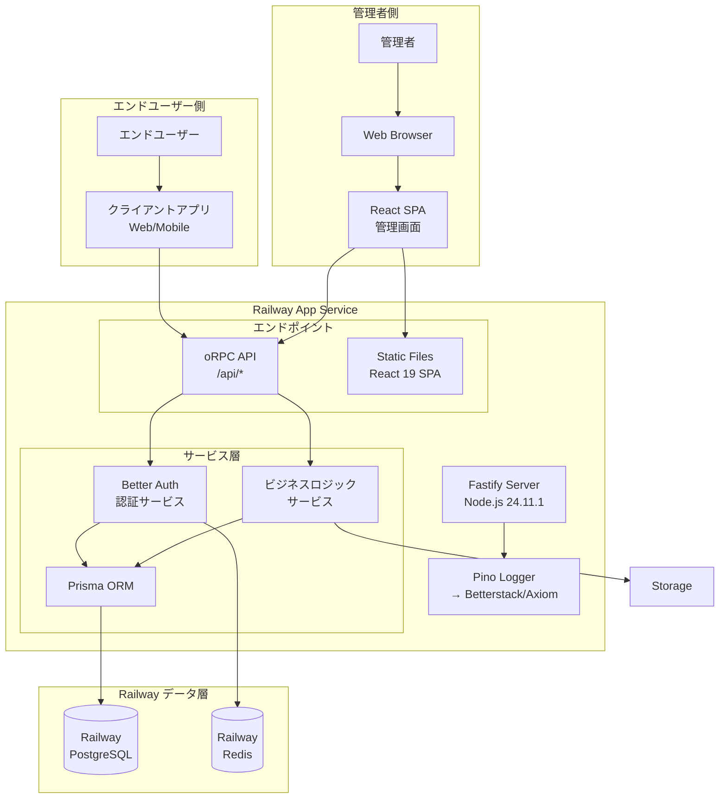

# 技術アーキテクチャドキュメント

このドキュメントは、フルスタックTypeScriptアプリケーションの全体的な技術アーキテクチャと、各層に共通する設計原則を説明します。

## 関連ドキュメント

本ドキュメントは以下の専門ドキュメントと連携しています：

- **[BACKEND.md](./BACKEND.md)** - バックエンド開発規約（Fastify、oRPC、Repository層など）
- **[FRONTEND.md](./FRONTEND.md)** - フロントエンド開発規約（React 19、Tailwind CSS、コンポーネント設計など）
- **[AUTH.md](./AUTH.md)** - 認証アーキテクチャ（管理画面認証、エンドユーザー認証）
- **[DATABASE.md](./DATABASE.md)** - データベース設計（Prismaスキーマ、拡張パターン）

**実装時の注意**: 各機能を実装する際は、該当する専門ドキュメントを必ず参照してください。

## ⚠️ 重要: AIエージェント・開発者への厳格な指示

**以下の規約は厳守してください。独自の判断での変更は禁止です。**

## 1. 技術スタック

### 1.1 Runtime & Languages
- **Node.js 24.11.1**: TypeScript直接実行サポート (`--experimental-transform-types`)
- **TypeScript 5.9.3**: 最新版、Node.js内蔵実行
- **Package Manager**: pnpm (高速・効率的な依存管理)
- **Monorepo**: Turborepo (高速ビルドシステム・タスクオーケストレーション)

### 1.2 Backend Framework
- **Fastify 5.1**: 高速Webフレームワーク
  - Plugin Architecture: モジュラー設計による機能分離
  - Schema Validation: JSON Schemaによる厳密なバリデーション
  - Type Providers: `@fastify/type-provider-typebox`による型安全性
- **oRPC latest**: 型安全・高パフォーマンスRPCライブラリ
  - End-to-End型安全性
  - OpenAPI自動生成
  - tRPCより2.8倍高速、2.6倍省メモリ
  - Fastify/React統合サポート
- **Better Auth latest**: モダン認証ライブラリ
  - Email/パスワード認証対応
  - 完全TypeScript対応
  - セッション・JWT両対応
- **Prisma 6.0**: 次世代TypeScript ORM
- **Pino 9.x**: 高性能ロギングライブラリ（Fastify推奨）

### 1.3 Frontend Framework
- **React 19.0**: 最新版React
  - Server Components & Actions
  - 新Hooks: `use`, `useActionState`, `useFormStatus`, `useOptimistic`
  - 自動最適化（useMemo/forwardRef不要）
- **TypeScript 5.9.3**: 型安全な開発
- **Vite 6.0**: 高速ビルドツール (Environment API搭載)
- **Tailwind CSS 3.4**: ユーティリティファーストCSSフレームワーク
- **React Router 6.28**: クライアントサイドルーティング
- **状態管理**: React標準のuseState/useContext/useReducer + React 19 Actions

### 1.4 データストア
- **PostgreSQL 16**: メインデータベース
- **Redis 7.2**: セッションストア、キャッシュ

### 1.5 インフラストラクチャ
- **Railway**: メインホスティングプラットフォーム
  - **Railway App Service**: Node.jsアプリケーションホスティング
  - **Railway PostgreSQL**: マネージドDB（ワンクリックプロビジョニング）
  - **Railway Redis**: マネージドキャッシュ
  - **Railway Variables**: 環境変数・シークレット管理（Sealed Variables対応）
  - **Railway Environments**: 本番/開発/PRプレビュー環境
- **Pino + Betterstack/Axiom**: ログ収集・監視（オプション）
- **Docker Compose**: ローカル開発環境

## 2. システムアーキテクチャ

### 2.1 全体構成



### 2.2 レイヤードアーキテクチャ

```
┌─────────────────────────────────────────┐
│          Presentation Layer             │
│  ・React SPA (管理画面)                 │
│  ・クライアントアプリ (エンドユーザー向け) │
└─────────────────────────────────────────┘
                    ↓
┌─────────────────────────────────────────┐
│           API Gateway Layer             │
│  ・Fastify Routes                       │
│  ・oRPC Procedures                      │
└─────────────────────────────────────────┘
                    ↓
┌─────────────────────────────────────────┐
│          Business Logic Layer           │
│  ・Services (Auth, Business, etc.)      │
│  ・Domain Models                        │
│  ・Business Rules                       │
└─────────────────────────────────────────┘
                    ↓
┌─────────────────────────────────────────┐
│         Data Access Layer               │
│  ・Prisma ORM                          │
│  ・Repository Pattern                   │
│  ・Cache Strategy                       │
└─────────────────────────────────────────┘
                    ↓
┌─────────────────────────────────────────┐
│          Infrastructure Layer           │
│  ・PostgreSQL (Railway)                 │
│  ・Redis (Railway)                      │
└─────────────────────────────────────────┘
```

## 3. プロジェクト構造

### 3.1 Monorepo構成 (Turborepo)

このプロジェクトはTurborepoを使用したmonorepo構成を採用しています。

```
project/
├── apps/                       # アプリケーション
│   ├── client/                 # @repo/client - React フロントエンド
│   │   ├── src/
│   │   │   ├── components/    # React コンポーネント
│   │   │   ├── pages/         # ページコンポーネント
│   │   │   ├── hooks/         # カスタムフック
│   │   │   ├── contexts/      # React Context定義
│   │   │   ├── services/      # oRPC APIクライアント
│   │   │   ├── i18n/          # i18n設定
│   │   │   ├── locales/       # 翻訳ファイル
│   │   │   └── styles/        # Tailwind CSS
│   │   ├── public/            # 静的ファイル
│   │   └── package.json
│   │
│   ├── server/                 # @repo/server - Fastify バックエンド
│   │   ├── src/
│   │   │   ├── procedures/    # oRPC Procedure定義
│   │   │   ├── routes/        # Fastifyルート定義
│   │   │   ├── services/      # ビジネスサービス層
│   │   │   ├── repositories/  # データアクセス層
│   │   │   ├── plugins/       # Fastifyプラグイン
│   │   │   ├── middleware/    # ミドルウェア
│   │   │   ├── auth/          # Better Auth設定
│   │   │   ├── config/        # 設定ファイル
│   │   │   ├── db/            # Prismaクライアント
│   │   │   ├── lib/           # ライブラリ（Sentry等）
│   │   │   └── utils/         # ユーティリティ関数
│   │   ├── prisma/            # Prismaスキーマ・マイグレーション
│   │   └── package.json
│   │
│   └── worker/                 # @repo/worker - ジョブワーカー
│       ├── src/
│       │   └── workers/       # Bee-queueワーカー定義
│       └── package.json
│
├── packages/                   # 共有パッケージ
│   ├── shared/                 # @repo/shared - 共有型・スキーマ
│   │   ├── src/
│   │   │   ├── config/        # 共通設定（i18n等）
│   │   │   ├── schemas/       # Zodスキーマ
│   │   │   └── types/         # TypeScript型定義
│   │   └── package.json
│   │
│   └── typescript-config/      # @repo/typescript-config
│       ├── base.json          # 共通TypeScript設定
│       ├── client.json        # クライアント用設定
│       └── server.json        # サーバー用設定
│
├── tests/                      # E2Eテスト
│   ├── e2e/                   # Playwright E2Eテスト
│   └── fixtures/              # テストフィクスチャ
│
├── turbo.json                  # Turborepo設定
├── pnpm-workspace.yaml         # pnpm ワークスペース設定
├── docker-compose.yml          # Docker構成
├── package.json                # ルートpackage.json
├── tsconfig.json               # ルートTypeScript設定
└── biome.json                  # Biome設定
```

### 3.2 パッケージ依存関係

```
@repo/client ─────┬──→ @repo/shared
                  └──→ @repo/server (型のみ)

@repo/server ─────┬──→ @repo/shared
                  └──→ @repo/typescript-config

@repo/worker ─────┬──→ @repo/server
                  └──→ @repo/shared
```

### 3.3 Turborepo タスク

| タスク | 説明 | 依存関係 |
|--------|------|----------|
| `build` | 全パッケージをビルド | `^build` (依存パッケージを先にビルド) |
| `dev` | 開発サーバー起動 | - |
| `lint` | Biomeによるリント | `^lint` |
| `format` | Biomeによるフォーマット | - |
| `typecheck` | TypeScript型チェック | `^typecheck` |
| `test` | テスト実行 | `^build` |
| `test:e2e` | E2Eテスト | `build` |
| `db:generate` | Prisma クライアント生成 | - |
| `db:migrate` | Prisma マイグレーション | - |

## 4. 開発規約

### 4.1 コードスタイル

#### TypeScript設定
- **Strict Mode**: 有効（変更禁止）
- **ESNext構文**: 使用
- **Module System**: ESM (ECMAScript Modules)のみ（CommonJS禁止）
- **Import Style**: TypeScript拡張子付きインポート (`.ts`, `.tsx`)必須

#### 命名規則
- **Components**: PascalCase (例: `UserProfile.tsx`)
- **Utilities**: camelCase (例: `formatDate.ts`)
- **Constants**: UPPER_SNAKE_CASE (例: `MAX_RETRY_COUNT`)
- **Interfaces/Types**: PascalCase (Prefix不要)
  - **Interface優先**: `interface User {}` (可能な限りinterfaceを使用)
  - **Type**: Union型や複雑な型の場合のみ使用

#### 🚫 TypeScript制限事項（絶対禁止）
以下の機能は使用禁止です。AIエージェントはこれらの代替実装を必ず使用してください：

| 禁止事項 | 必須の代替実装 | 例 |
|---------|-------------|---|
| **Enum** | const assertion または Union型 | `const Status = { Active: 'active', Inactive: 'inactive' } as const` |
| **Namespace** | ESモジュール | 個別のexport/import |
| **Parameter Properties** | 明示的プロパティ宣言 | constructorで個別に宣言 |
| **Decorators** | 使用不可 | 関数コンポジションで代替 |
| **Class** (Component以外) | 関数・オブジェクト | 下記の関数ベース設計参照 |
| **I/Tプレフィックス** | プレフィックスなし | `interface User {}` (IUser禁止) |
| **Prismaモデルの直接拡張** | `$extends`機能を使用 | `prisma.$extends({ model: {...} })` |

### 4.2 テスト戦略

包括的なテスト戦略については **[TEST.md](./TEST.md)** を参照してください。

#### テストピラミッド
```
         /\
        /  \  E2E Tests (Playwright Agents)
       /    \ - AI自動生成テスト
      /──────\ - メインストリーム自動テスト
     /        \ Integration Tests (Vitest)
    /──────────\ - API endpoints & Routes
   /            \ Unit Tests (Vitest)
  /──────────────\ - Business logic & Schemas
 /________________\ - Target: 80% coverage
```

#### テストファイルの配置

- **単体テスト**: `apps/*/src/**/*.test.ts`, `packages/*/src/**/*.test.ts` - アプリケーションコードと同じディレクトリ
- **統合テスト**: `apps/*/src/**/*.integration.test.ts` - アプリケーションコードと同じディレクトリ
- **E2Eテスト**: `tests/e2e/**/*.spec.ts` - 専用ディレクトリ

詳細な配置ルール、命名規則、ベストプラクティスは **[TEST.md](./TEST.md)** を参照してください。

### 4.3 Git運用 (Trunk-Based Development)

#### ブランチ戦略
- `main` - 単一の本流ブランチ（継続的デプロイ）
- `feature/*` - 短命な機能ブランチ（1-2日以内にマージ）
- `hotfix/*` - 緊急修正（即座にマージ）

#### マージ戦略
- 小さく頻繁なコミット
- Feature flagsによる機能の段階的リリース
- Pull Requestは迅速にレビュー（24時間以内）
- mainブランチは常にデプロイ可能な状態を維持

#### コミット規約 (Conventional Commits)
```
feat: 新機能
fix: バグ修正
docs: ドキュメント
style: コード整形
refactor: リファクタリング
test: テスト
chore: ビルド・ツール関連
```

## 5. 外部依存関係

### 5.1 Railway Services
- **Railway App Service**: アプリケーションホスティング（ゼロコンフィグデプロイ）
- **Railway PostgreSQL**: マネージドデータベース（ワンクリックプロビジョニング）
- **Railway Redis**: マネージドキャッシュ
- **Railway Variables**: 環境変数・シークレット管理
  - Sealed Variables: 機密情報の暗号化保存（UIから閲覧不可）
  - Reference Variables: サービス間での変数参照
- **Railway Environments**: 本番/開発/PRプレビュー環境の自動管理
- **Betterstack/Axiom**: ログ収集・監視（オプション）

### 5.2 LLM Provider (OpenRouter)

**OpenRouter SDK**を使用してLLM APIへのアクセスを提供します。

#### 特徴
- **300+モデル対応**: OpenAI、Anthropic、Google等の主要LLMにアクセス可能
- **動的モデル切り替え**: 管理画面からシステム再起動なしでモデル変更
- **キャッシュ最適化**: 5分間の設定キャッシュでパフォーマンス向上

#### アーキテクチャ
```
┌─────────────────────────────────────┐
│          管理画面                     │
│  ・LLM設定ページ (/admin/settings)   │
│  ・モデル選択、パラメータ調整         │
└─────────────────────────────────────┘
              ↓ oRPC
┌─────────────────────────────────────┐
│      LLMプロバイダーサービス          │
│  ・sendChatRequest                  │
│  ・sendChatRequestWithJsonResponse  │
│  ・設定キャッシュ (5分TTL)           │
└─────────────────────────────────────┘
              ↓
┌─────────────────────────────────────┐
│         OpenRouter SDK              │
│  ・@openrouter/sdk                  │
│  ・API認証 (OPENROUTER_API_KEY)     │
└─────────────────────────────────────┘
              ↓
┌─────────────────────────────────────┐
│        SystemSetting (DB)           │
│  ・llm.model                        │
│  ・llm.maxTokens                    │
│  ・llm.temperature                  │
└─────────────────────────────────────┘
```

詳細な使用方法は **[BACKEND.md](./BACKEND.md)** の「7. LLMプロバイダーサービス」を参照してください。

## 6. 開発ツール

### 6.1 ビルド・実行
```bash
# 開発サーバー起動（全パッケージ）
pnpm run dev

# 特定パッケージの開発サーバー
pnpm run dev --filter @repo/client
pnpm run dev --filter @repo/server

# 型チェック (CIで実行)
pnpm run typecheck

# ビルド (本番用)
pnpm run build
```

### 6.2 品質管理
- **Biome**: Linting + Formatting統合ツール
- **Vitest**: 高速テストランナー
- **Playwright**: ブラウザ自動テスト
- **TypeScript**: 厳密な型チェック

### 6.3 開発環境
- **Docker Compose**: ローカルDB/Redis環境
- **Hot Reload**: Vite + nodemon

## 7. 実装品質チェック手順

### AIエージェント・開発者への必須確認事項

#### 実装時の検証サイクル

**10-20行実装するごとに必ず実行：**
```bash
# 1. コードフォーマット
pnpm run format

# 2. リントチェック
pnpm run lint

# 3. 型チェック
pnpm run typecheck
```

**機能完成時に必ず実行：**
```bash
# 4. ビルド確認
pnpm run build

# 5. テスト実行
pnpm run test
```

#### チェックリスト

実装前：
- [ ] `@PROJECT.md` でビジネス要件を確認した
- [ ] 該当する専門ドキュメント（BACKEND.md、FRONTEND.md等）を読んだ
- [ ] 禁止事項リストを確認した

実装中：
- [ ] 10-20行ごとにlint/formatを実行している
- [ ] Classではなく関数/オブジェクトを使用している
- [ ] Enumではなくconst assertionを使用している

実装後：
- [ ] すべてのチェックコマンドがパスする
- [ ] 設計パターンに準拠している
- [ ] テストが書かれている

## 8. セキュリティアーキテクチャ

本システムは、**2つの独立した認証システム**を実装します：

### 8.1 認証システムの分離設計

```
┌─────────────────────────────────────┐
│        管理画面認証                   │
│  (Better Auth + PostgreSQL)          │
│  - User/Session/Account テーブル     │
│  - Cookie ベースセッション            │
│  - Email/パスワード認証              │
└─────────────────────────────────────┘
              ↕ 独立
┌─────────────────────────────────────┐
│      エンドユーザー認証               │
│  (カスタム実装 + Redis)              │
│  - EndUser テーブル                 │
│  - Redis セッション                  │
│  - カスタム認証フロー                │
└─────────────────────────────────────┘
```

**分離のメリット**:
- セキュリティ境界の明確化
- 管理者情報漏洩時の影響範囲限定
- 異なるセッション有効期限の設定
- 独立したスケーリング可能

詳細は **[AUTH.md](./AUTH.md)** を参照してください。

### 8.2 データ保護
- 個人情報の暗号化（保存時・通信時）
- Railway Sealed Variablesによるシークレット管理
- SSL/TLS通信の強制（Railway自動HTTPS）
- SQLインジェクション対策 (Prisma)

### 8.3 監査・ログ
- Pino + Betterstack/Axiomによる集約ログ
- アクセスログの記録
- エラートラッキング
- セキュリティイベントの監視

### 8.4 エラー監視 (Sentry)

**Sentry**を使用して、クライアント・サーバー両方のエラーをリアルタイムで監視します。

#### 構成
- **クライアント**: `@sentry/react` - React 19のエラーハンドリング統合
- **サーバー**: `@sentry/node` - Fastifyエラーハンドラー統合

#### 環境変数
| 変数名 | 用途 | 説明 |
|--------|------|------|
| `SENTRY_DSN` | サーバー | Node.js/Fastify用DSN |
| `VITE_SENTRY_DSN` | クライアント | React用DSN（Viteで公開） |

#### 動作
- **本番環境のみ**: 開発環境ではSentryへのエラー送信は無効化
- **自動捕捉**: キャッチされないエラー、Reactコンポーネントエラー、APIエラーを自動収集
- **トレース無効**: 初期設定ではパフォーマンストレースは無効（将来の拡張として検討）

## 9. パフォーマンス最適化

### 9.1 Backend最適化
- Response Schema定義による高速シリアライゼーション（2-3倍高速化）
- 非同期処理の最適化（Promise.all()活用）
- Prismaクエリ最適化（Select/Include最適化）
- 詳細は **[BACKEND.md](./BACKEND.md)** を参照

### 9.2 Frontend最適化
- React 19のConcurrent Features
- Code Splitting (React.lazy)
- Bundle Size最適化 (Vite)
- 詳細は **[FRONTEND.md](./FRONTEND.md)** を参照

### 9.3 インフラ最適化
- Railway Auto-scaling（Proプラン以上）
- Database Indexing
- Connection Pooling

## 10. スケジューラーアーキテクチャ

システムは定期的なバックグラウンドタスクを実行するため、**node-cron**を使用した複数のスケジューラーを実装できます。

### 10.1 スケジューラーの実装パターン

**基本構造**:
```typescript
// apps/server/src/schedulers/example-scheduler.ts
export async function executeTask(): Promise<{
  success: number
  failed: number
  total: number
}> {
  // タスク実行ロジック
}
```

**起動設定** (`apps/server/src/index.ts`):
```typescript
import cron from 'node-cron'
import { executeTask } from './schedulers/example-scheduler'

// アプリケーション起動時に登録
cron.schedule(
  '* * * * *', // cron式
  async () => {
    try {
      await executeTask()
    } catch (error) {
      logger.error({ error }, 'スケジューラーエラー')
    }
  },
  {
    timezone: 'Asia/Tokyo', // タイムゾーン指定
  },
)
```

### 10.2 スケジューラー設計原則

1. **べき等性**: 同じタスクを複数回実行しても安全
2. **エラーハンドリング**: エラー発生時もスケジューラーは停止しない
3. **ログ出力**: 実行結果を必ずログに記録
4. **パフォーマンス**: インデックスを活用した効率的なクエリ
5. **バッチ処理**: 外部API制限を考慮したバッチ処理

### 10.3 監視・運用

- **ログ監視**: Betterstack/Axiomでスケジューラーの実行状況を監視
- **エラーアラート**: 連続失敗時のアラート設定
- **メトリクス**: 成功数・失敗数・総数をログ出力

## 11. Railway デプロイガイド

### 11.1 初期セットアップ

```bash
# Railway CLIインストール
npm install -g @railway/cli

# ログイン
railway login

# プロジェクト作成
railway init
```

### 11.2 サービス構成

1. **アプリケーション**: GitHubリポジトリ連携で自動デプロイ
2. **PostgreSQL**: プロジェクト内で「Add Plugin」→「PostgreSQL」
3. **Redis**: プロジェクト内で「Add Plugin」→「Redis」

### 11.3 環境変数設定

```bash
# 変数の設定（CLI）
railway variables set DATABASE_URL="..."
railway variables set REDIS_URL="..."

# Reference Variables（railway.toml または UI）
# 例: ${{Postgres.DATABASE_URL}}
```

### 11.4 本番デプロイ

```bash
# デプロイ（GitHubプッシュで自動実行される）
railway up

# ログ確認
railway logs
```

### 11.5 設定ファイル (railway.toml)

```toml
[build]
builder = "NIXPACKS"

[deploy]
startCommand = "pnpm run start --filter @repo/server"
healthcheckPath = "/health"
healthcheckTimeout = 100
restartPolicyType = "ON_FAILURE"
restartPolicyMaxRetries = 10
```

### 11.6 重要な設定

- **PORT**: Railwayが自動で`PORT`環境変数を設定（アプリはこれをlistenする）
- **HOST**: `0.0.0.0`でlistenすること（localhost不可）
- **DATABASE_URL/REDIS_URL**: Railwayが自動でプロビジョニング・設定

---

## 変更履歴

### 2025年12月
- ボイラープレートテンプレートとして初期化
- 汎用的なアプリケーション構成に変更
- LLMプロバイダー（OpenRouter SDK統合）のアーキテクチャ追加
- Azure からRailwayへのインフラ移行

最終更新: 2025年12月
