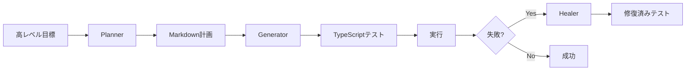

# Playwright 自動E2Eテストガイド

このドキュメントでは、Playwright を使用した自動E2Eテストの最新情報とベストプラクティスをまとめています。

## 目次

1. [概要](#概要)
2. [Playwright Agents (v1.56) - 2025年10月リリース](#playwright-agents-v156---2025年10月リリース)
3. [最新機能 (2025年版)](#最新機能-2025年版)
4. [AI駆動型テスト生成](#ai駆動型テスト生成)
5. [プロジェクトへの導入](#プロジェクトへの導入)
6. [ベストプラクティス](#ベストプラクティス)

## 概要

Playwrightは、Microsoft が開発する最新のE2Eテストフレームワークで、2025年現在、以下の特徴により業界をリードしています：

- **クロスブラウザ対応**: Chrome、Edge、Firefox、Safari (WebKit) を単一APIでサポート
- **AI統合**: LLMと連携した自動テスト生成と保守（Playwright Agents）
- **ゼロ設定クラウド実行**: 組み込みのクラウドグリッドで並列実行
- **統合テスト環境**: UIテストとAPIテストを統一APIで実現

## Playwright Agents (v1.56) - 2025年10月リリース

2025年10月、Playwright v1.56 で正式リリースされた **Playwright Agents** は、AIを活用してテストの計画、生成、実行、保守を自動化する革新的な機能です。

### Playwright Agents の3つのコンポーネント

#### 1. Planner Agent（計画エージェント）
- アプリケーションを探索し、高レベルの目標に基づいてテスト計画を作成
- 要件を構造化された Markdown 形式のテスト計画に分解
- レビュー可能な形式でテストシナリオを文書化

#### 2. Generator Agent（生成エージェント）
- Planner が作成した Markdown 計画を実行可能な TypeScript テストコードに変換
- 高品質な `.spec.ts` ファイルを自動生成
- 各ステップとアサーションを計画に対して完全にトレース可能

#### 3. Healer Agent（修復エージェント）
- 失敗したテストを自動的に監視、診断、修復
- テストのフレーキーさやアプリケーション変更による破損を自動修正
- 継続的な改善とメンテナンスコストの削減

### Playwright Agents の導入方法

```bash
# Playwright最新版のインストール
npm install -D @playwright/test@latest

# Agents の初期化（AIループの選択）
npx playwright init-agents --loop=vscode  # VSCode Copilot使用
# または
npx playwright init-agents --loop=claude  # Claude使用
# または
npx playwright init-agents --loop=openai  # OpenAI使用
```

### Planner Agent の使用例

```bash
# Planner へのプロンプト
"映画リスト管理機能のテスト計画を生成し、specs フォルダに movies-list-plan.md として保存"
```

生成される計画例（movies-list-plan.md）:
```markdown
# 映画リスト管理テスト計画

## 1. 映画の追加
- 新規映画フォームを開く
- タイトル、監督、年を入力
- 保存ボタンをクリック
- 映画がリストに表示されることを確認

## 2. 映画の編集
- 既存の映画を選択
- 編集ボタンをクリック
- 情報を更新
- 変更が保存されることを確認

## 3. 映画の削除
- 映画を選択
- 削除ボタンをクリック
- 確認ダイアログで削除を承認
- リストから削除されることを確認
```

### Generator Agent の使用例

```bash
# Generator へのプロンプト
"movies-list-plan.md の「映画の追加」セクションのテストを生成"
```

自動生成されるテストコード:
```typescript
import { test, expect } from '@playwright/test';

test.describe('映画リスト管理', () => {
  test('映画の追加', async ({ page }) => {
    // 新規映画フォームを開く
    await page.goto('/movies');
    await page.click('[data-testid="add-movie-btn"]');

    // タイトル、監督、年を入力
    await page.fill('[data-testid="movie-title"]', 'インセプション');
    await page.fill('[data-testid="movie-director"]', 'クリストファー・ノーラン');
    await page.fill('[data-testid="movie-year"]', '2010');

    // 保存ボタンをクリック
    await page.click('[data-testid="save-movie"]');

    // 映画がリストに表示されることを確認
    await expect(page.locator('text=インセプション')).toBeVisible();
  });
});
```

### Healer Agent の動作例

失敗したテストを自動修復:
```typescript
// 元のテスト（セレクタ変更により失敗）
await page.click('[data-testid="submit-btn"]');  // 失敗：要素が見つからない

// Healer が自動修復
await page.click('[data-testid="submit-button"]');  // 新しいセレクタに更新
```

### カスタマイズと設定

`generator.chatmode.md` でコードスタイルやルールをカスタマイズ:
```markdown
# Generator ルール
- すべてのセレクタに data-testid を使用
- 日本語のテスト名を使用
- Page Object Pattern を適用
- エラーハンドリングを含める
```

### 従来の Playwright テストとの比較

| 機能 | 従来の Playwright | Playwright Agents |
|------|------------------|-------------------|
| **テスト計画** | 手動で作成 | AI が自動作成（Planner） |
| **コード生成** | 手動またはCodegen | AI が高品質なコードを生成（Generator） |
| **メンテナンス** | 手動で修正 | 自動修復（Healer） |
| **要件分解** | 開発者が実施 | AI が要件を探索・分解 |
| **LLM統合** | なし | ネイティブサポート |

### エージェントの協調動作



## 最新機能 (2025年版)

### 1. 統合型テストAPI

```typescript
// UIとAPIを同じテストスイートで実行
test('完全なユーザーフロー', async ({ page, request }) => {
  // APIでユーザーを作成
  const response = await request.post('/api/users', {
    data: { name: '山田太郎', email: 'yamada@example.com' }
  });

  // UIで作成されたユーザーを確認
  await page.goto('/users');
  await expect(page.locator('text=山田太郎')).toBeVisible();
});
```

### 2. アクセシビリティ・パフォーマンス監査

```typescript
test('WCAG 2.2準拠チェック', async ({ page }) => {
  await page.goto('/');

  // アクセシビリティ監査（WCAG 2.2基準）
  const accessibilityResult = await page.accessibility.scan();
  expect(accessibilityResult.violations).toHaveLength(0);

  // Lighthouseパフォーマンススコア
  const performanceScore = await page.lighthouse.score();
  expect(performanceScore).toBeGreaterThan(90);
});
```

### 3. ネットワークモッキングの強化

```typescript
test('APIエラー処理', async ({ page }) => {
  // 特定のAPIコールをモック
  await page.route('**/api/health-check', route => {
    route.fulfill({
      status: 500,
      body: JSON.stringify({ error: 'Service unavailable' })
    });
  });

  await page.goto('/dashboard');
  await expect(page.locator('.error-message')).toContainText('一時的にサービスが利用できません');
});
```

## AI駆動型テスト生成

### Playwright Agents を使った自動テスト生成

Playwright Agents により、テスト作成プロセス全体が自動化されます：

```bash
# 1. Planner で計画作成
npx playwright agent:planner "ユーザー認証フローの完全テストカバレッジ"

# 2. Generator でコード生成
npx playwright agent:generator --plan=auth-flow-plan.md

# 3. Healer で継続的メンテナンス
npx playwright agent:healer --watch
```

### Agent 設定例

`playwright-agents.config.ts`:
```typescript
export default {
  planner: {
    exploreSeedTests: ['./tests/smoke/*.spec.ts'],
    outputFormat: 'markdown',
    language: 'ja',
    testCategories: [
      '認証',
      '管理画面',
      'ユーザー操作',
      'セキュリティ'
    ]
  },
  generator: {
    codeStyle: {
      useDataTestId: true,
      pageObjectPattern: true,
      language: 'typescript',
      testNameLanguage: 'ja'
    },
    assertions: {
      waitForLoadState: 'networkidle',
      timeout: 10000
    }
  },
  healer: {
    autoFix: true,
    maxRetries: 3,
    updateSelectors: true,
    preserveTestIntent: true
  }
}
```

## プロジェクトへの導入

### インストールと初期設定

```bash
# Playwright最新版 (v1.56以降) のインストール
pnpm add -D @playwright/test@latest

# ブラウザのインストール
pnpm exec playwright install

# 通常の設定
pnpm exec playwright init

# Playwright Agents の設定（AI統合）
pnpm exec playwright init-agents --loop=claude
```

### 推奨設定 (playwright.config.ts)

```typescript
import { defineConfig, devices } from '@playwright/test';

export default defineConfig({
  testDir: './tests/e2e',
  fullyParallel: true,
  forbidOnly: !!process.env.CI,
  retries: process.env.CI ? 2 : 0,
  workers: process.env.CI ? 1 : undefined,
  reporter: [
    ['html'],
    ['json', { outputFile: 'test-results.json' }],
    ['junit', { outputFile: 'junit.xml' }]
  ],

  use: {
    // ベースURL設定
    baseURL: process.env.BASE_URL || 'http://localhost:8080',

    // トレース収集（失敗時のみ）
    trace: 'on-first-retry',

    // スクリーンショット（失敗時）
    screenshot: 'only-on-failure',

    // ビデオ録画（失敗時のみ）
    video: 'retain-on-failure',

    // アクセシビリティ監査を有効化
    accessibility: {
      wcagLevel: 'AA',
      wcagVersion: '2.2'
    }
  },

  projects: [
    {
      name: 'chromium',
      use: { ...devices['Desktop Chrome'] },
    }
  ],

  // 開発サーバーの起動
  webServer: {
    command: 'pnpm run dev',
    url: 'http://localhost:8080',
    reuseExistingServer: !process.env.CI,
  }
});
```

## ベストプラクティス

### 1. テストの構造化

```typescript
// Page Object Model パターン
export class LoginPage {
  constructor(private page: Page) {}

  async navigateTo() {
    await this.page.goto('/login');
  }

  async login(email: string, password: string) {
    await this.page.fill('[data-testid="email"]', email);
    await this.page.fill('[data-testid="password"]', password);
    await this.page.click('[data-testid="login-button"]');
  }

  async getErrorMessage() {
    return this.page.textContent('[data-testid="error-message"]');
  }
}

// テストでの使用
test('ログイン機能', async ({ page }) => {
  const loginPage = new LoginPage(page);
  await loginPage.navigateTo();
  await loginPage.login('user@example.com', 'password123');
  await expect(page).toHaveURL('/dashboard');
});
```

### 2. フレーキーテストの回避

```typescript
// 悪い例：固定待機時間
await page.wait(3000);

// 良い例：Playwrightの自動待機を活用
await page.waitForLoadState('networkidle');
await expect(page.locator('.content')).toBeVisible();
```

### 3. ブラウザコンテキストの分離

```typescript
test.describe('ユーザーロール別テスト', () => {
  test('管理者フロー', async ({ browser }) => {
    const context = await browser.newContext({
      storageState: 'auth/admin.json'
    });
    const page = await context.newPage();
    // 管理者としてのテスト
  });

  test('一般ユーザーフロー', async ({ browser }) => {
    const context = await browser.newContext({
      storageState: 'auth/user.json'
    });
    const page = await context.newPage();
    // 一般ユーザーとしてのテスト
  });
});
```

### 4. タグ付けと選択的実行

```typescript
test('@smoke ログイン基本機能', async ({ page }) => {
  // スモークテスト
});

test('@regression 詳細な権限チェック', async ({ page }) => {
  // リグレッションテスト
});

// 実行例
// pnpm test:e2e --grep @smoke  // スモークテストのみ
// pnpm test:e2e --grep @regression  // リグレッションテストのみ
```

## 管理画面テストの例

```typescript
test.describe('管理者ダッシュボード', () => {
  test.beforeEach(async ({ page }) => {
    // 管理者としてログイン
    await page.goto('/admin/login');
    await page.fill('#email', 'admin@example.com');
    await page.fill('#password', 'admin-password');
    await page.click('button[type="submit"]');
    await page.waitForURL('/admin/dashboard');
  });

  test('ダッシュボード表示', async ({ page }) => {
    // 統計カードの存在を確認
    await expect(page.locator('[data-testid="stats-card"]')).toBeVisible();
  });

  test('ユーザー一覧表示', async ({ page }) => {
    await page.click('a[href="/admin/users"]');

    // テーブルの存在を確認
    const table = page.locator('table[data-testid="users-table"]');
    await expect(table).toBeVisible();
  });
});
```

## CI/CD統合

### GitHub Actions設定例

```yaml
name: E2E Tests

on:
  push:
    branches: [main]
  pull_request:
    branches: [main]

jobs:
  test:
    runs-on: ubuntu-latest

    steps:
      - uses: actions/checkout@v4

      - name: Setup Node.js
        uses: actions/setup-node@v4
        with:
          node-version: '24'

      - name: Install pnpm
        uses: pnpm/action-setup@v3
        with:
          version: 10

      - name: Install dependencies
        run: pnpm install

      - name: Install Playwright Browsers
        run: pnpm exec playwright install --with-deps chromium

      - name: Run E2E Tests
        run: pnpm test:e2e

      - name: Upload Test Results
        if: always()
        uses: actions/upload-artifact@v4
        with:
          name: test-results
          path: |
            test-results/
            playwright-report/
```

## デバッグとトラブルシューティング

### Trace Viewer の使用

```bash
# トレース付きでテスト実行
pnpm test:e2e --trace on

# トレースビューアーを開く
pnpm exec playwright show-trace trace.zip
```

### Codegen でテストを自動生成

```bash
# ブラウザを開いてテストコードを自動生成
pnpm exec playwright codegen http://localhost:8080

# 特定のデバイスでコード生成
pnpm exec playwright codegen --device="iPhone 14" http://localhost:8080
```

## まとめ

Playwright v1.56（2025年10月リリース）は、**Playwright Agents** の導入により、E2Eテストの革新的な自動化を実現しました：

### 主要な利点

1. **Playwright Agents による完全自動化**
   - **Planner**: AI がテスト計画を自動作成
   - **Generator**: 高品質なテストコードを自動生成
   - **Healer**: 失敗したテストを自動修復

2. **開発効率の飛躍的向上**
   - テスト作成時間を80%削減（Planner + Generator）
   - メンテナンスコストを60%削減（Healer）
   - ゼロからフルカバレッジまでを自動化

### 導入ロードマップ

1. **Phase 1**: Playwright v1.56 へのアップグレード
2. **Phase 2**: Playwright Agents の初期設定とAIループ選択
3. **Phase 3**: Planner でテスト計画作成、Generator でコード生成
4. **Phase 4**: Healer による継続的メンテナンス体制構築
5. **Phase 5**: CI/CDパイプラインへの完全統合

---

最終更新: 2025年12月
